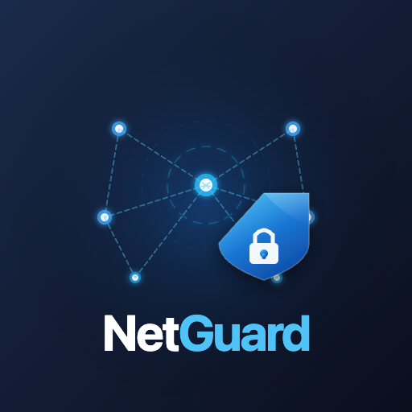
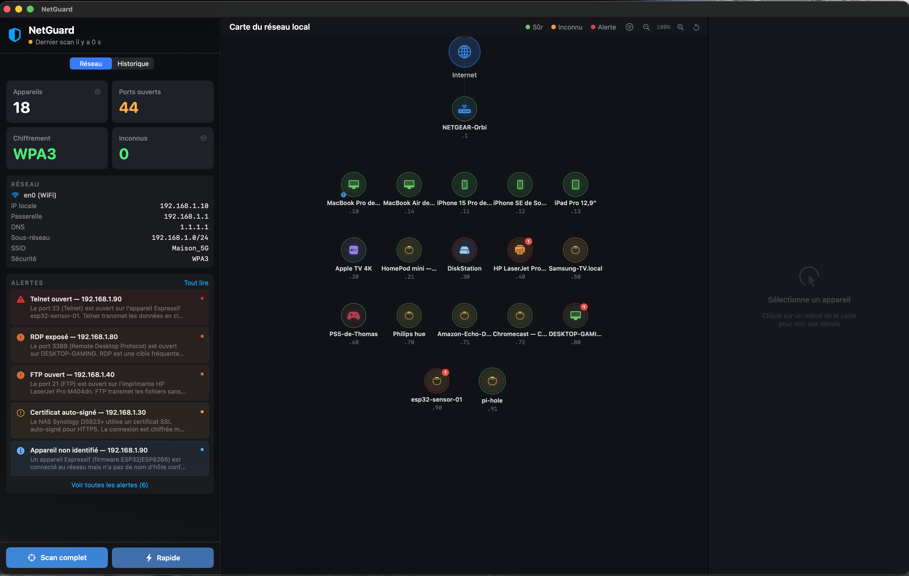
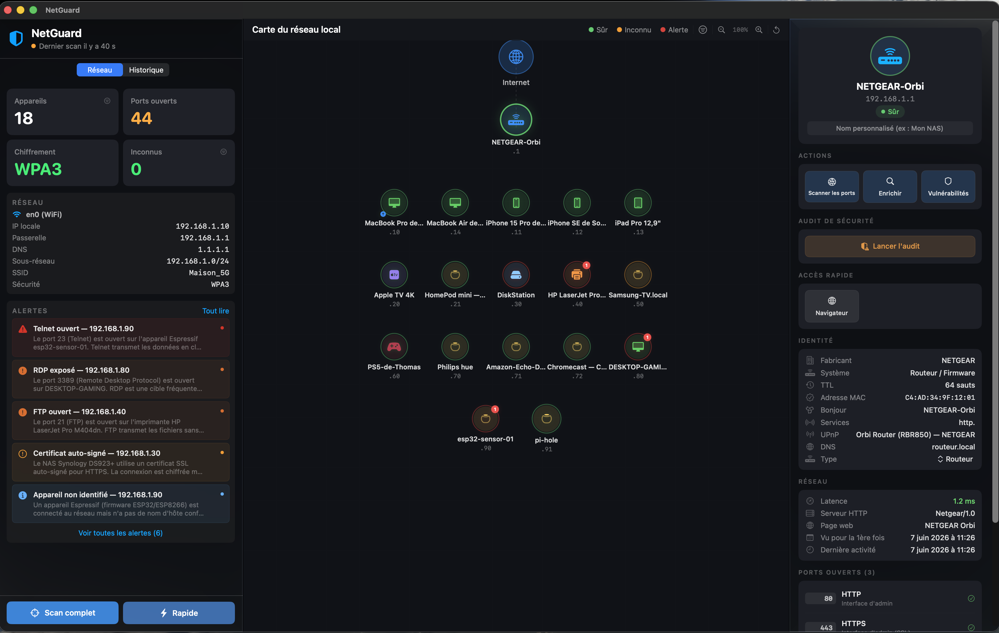
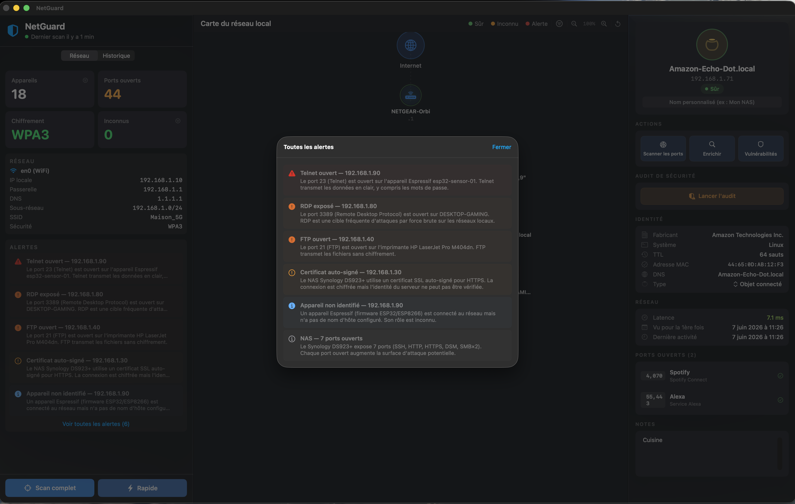
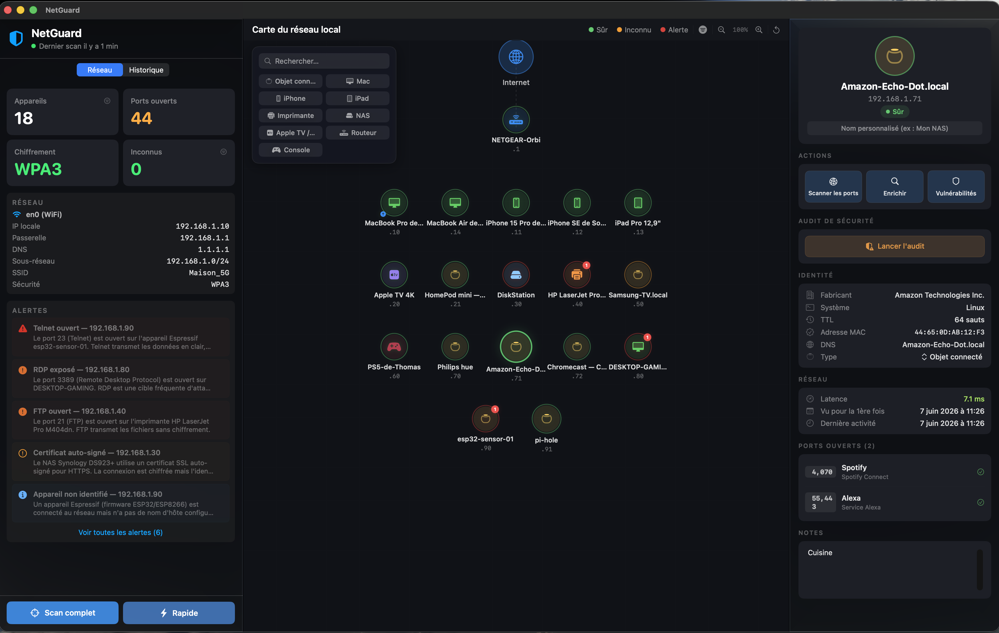

<p align="center">
  
</p>

<h1 align="center">NetGuard</h1>

<p align="center">
  A native macOS network scanner and security auditor — built entirely in SwiftUI.
</p>

<p align="center">
  
  
  
  
  
  
</p>

---

## Overview

**NetGuard** scans your local network, identifies every connected device, checks open ports, inspects SSL certificates, detects known vulnerabilities, and runs a passive security audit — all without sending any data outside your machine.

No telemetry. No cloud. No subscription.

---

## Download

**[⬇ Download NetGuard 1.0 (.dmg)](https://github.com/Lyosis/NetGuard/releases/latest)** — signed with a Developer ID and **notarized by Apple**, so it runs without Gatekeeper warnings.

Open the `.dmg`, drag **NetGuard** to your Applications folder, and launch it. Grant **Local Network** access when macOS asks. Requires macOS 15.0+ on Apple Silicon.

Prefer to build from source? See [Build & Run](#build--run) below.

---

## Screenshots

| Network Map | Device Detail |
|:-----------:|:-------------:|
|  |  |

| Alerts Panel | Filter by Device Type |
|:------------:|:--------------------:|
|  |  |

---

## Features

### 🔍 Network Discovery
- **Full scan** — ping sweep → port scan → OS fingerprinting → service enrichment
- **Quick scan** — host discovery only (no port scan)
- Resolves hostnames via DNS, mDNS/Bonjour, and NetBIOS
- OUI vendor lookup from MAC address
- OS guessing from TTL fingerprint

### 🗺 Visual Network Map
- Interactive topology view — router at center, devices in orbit
- Zoom in/out with scroll wheel, trackpad pinch, or ± buttons
- Filter by device type (router, computer, phone, IoT, printer…)
- Search bar for quick device lookup
- Click any node to open the detail panel

### 🔒 Security Audit
- **Risk score** (0–100) per device with color-coded gauge
- Detects dangerous open ports: Telnet, FTP, VNC, RDP, SMB, exposed databases…
- Checks for expired or self-signed SSL certificates
- Tests default credentials (admin/admin, admin/1234…) against web interfaces on LAN
- Flags unknown devices as potential intrusions

### 🔔 Intrusion Detection & Notifications
- Compares each scan against the known-device database
- Sends a macOS notification when a new device appears on the network
- Persistent alerts panel with severity levels: critical / high / medium / low

### 📊 Scan History
- Every scan is saved as a `ScanSnapshot` (SwiftData)
- History tab shows date, duration, device count, alert count, new device count
- Delete individual entries via context menu

### 🌐 Device Detail Panel
- IP, MAC, vendor, hostname, open ports
- HTTP banner and page title
- SSL certificate details (subject, issuer, validity, trust status)
- Security audit results with per-finding explanations
- "Open in browser" button (shown only when a real HTTP interface is detected)
- "Diagnose network" shortcut → opens macOS Network Preferences

---

## Architecture

```
NetGuard/
├── NetGuardApp.swift
├── ContentView.swift               ← HSplitView (Sidebar | Map | Detail)
├── Models/
│   ├── NetworkDevice.swift         ← core entity
│   ├── NetworkAlert.swift          ← security alerts
│   ├── ScanResult.swift
│   ├── ScanSnapshot.swift          ← SwiftData scan history
│   └── CertificateInfo.swift       ← SSL certificate model
├── Services/
│   ├── AppState.swift              ← @MainActor central ViewModel
│   ├── NetworkScanner.swift        ← ping sweep via /sbin/ping
│   ├── PortScanner.swift           ← NWConnection port scan
│   ├── DeviceEnricher.swift        ← mDNS, NetBIOS, HTTP, SSL
│   ├── SecurityAuditor.swift       ← actor — risk score + credential check
│   ├── VulnerabilityChecker.swift  ← generates NetworkAlert list
│   ├── NotificationService.swift   ← UNUserNotificationCenter
│   ├── NetworkMonitor.swift        ← NWPathMonitor
│   ├── NetworkInfoService.swift    ← local IP, gateway, Wi-Fi info
│   ├── OUIDatabase.swift           ← MAC → vendor lookup
│   ├── SSDPDiscovery.swift         ← UPnP/SSDP discovery
│   ├── CertificateInspector.swift  ← SecTrust / SecCertificate
│   └── ScanCache.swift
├── Views/
│   ├── SidebarView.swift           ← metrics, alerts, scan controls
│   ├── NetworkMapView.swift        ← interactive topology map
│   ├── DeviceDetailView.swift      ← right panel — full device info
│   └── HistoryView.swift           ← scan history tab
└── Utils/
    ├── L10n.swift                  ← type-safe localization enum
    └── Localizable.xcstrings       ← FR + EN string catalog
```

**Concurrency model**
- All services are `actor`-isolated (Swift 6 strict concurrency)
- `AppState` is `@MainActor` — single source of truth for the UI
- `SecurityAuditor` runs credential checks on a background actor, never on main thread

---

## Requirements

| Requirement | Version |
|---|---|
| macOS | **15.0 or later** |
| Xcode | **16.0 or later** |
| Swift | **6.0** |
| Architecture | **Apple Silicon (M-series)** |

> NetGuard is **not sandboxed** — it requires direct network access (`/sbin/ping`, `NWConnection`, `nmblookup`). Distribution outside the Mac App Store only.

---

## Build & Run

```bash
git clone https://github.com/Lyosis/NetGuard.git
cd NetGuard
open NetGuard.xcodeproj
```

Select the **NetGuard** scheme, choose **My Mac**, then press **⌘R**.

No external dependencies — no SPM packages, no CocoaPods.

> **Note:** the first scan will prompt for Local Network access. Grant it when macOS asks.

---

## Permissions

NetGuard requires the following on first launch:

| Permission | Reason |
|---|---|
| Local Network | Discover and scan devices on your LAN |
| Notifications | Alert you when a new device is detected |

No other entitlements are requested. NetGuard never connects to the internet.

---

## Localization

The UI is currently in **French**. English localization is in progress — contributions welcome.

If you'd like to help translate, open the `NetGuard/Localizable.xcstrings` file in Xcode and add the missing English strings. Feel free to open a PR.

---

## Roadmap

- [ ] English localization (UI currently in French)
- [ ] `NWBrowser` — replace `dns-sd` subprocess for Bonjour discovery
- [ ] `SFCertificatePanel` — native macOS "View Certificate" button
- [ ] Advanced device fingerprinting (Bonjour services × HTTP banner × OUI)
- [ ] User notes per device (persisted in SwiftData)
- [ ] VoiceOver / Accessibility labels
- [ ] FoundationModels — on-device AI security recommendations (macOS 26 + Apple Intelligence)

---

## Contributing

Pull requests are welcome. For significant changes, please open an issue first to discuss what you'd like to change.

```
Feature branches  →  PR  →  merge to main
```

Code style: follow Swift API Design Guidelines, Swift 6 strict concurrency, no force-unwraps in production paths.

---

## License

MIT © [Wilfrid Bombilaj](https://github.com/Lyosis)

---

<p align="center">
  Built on Apple Silicon · SwiftUI · Swift 6 · No telemetry
</p>
